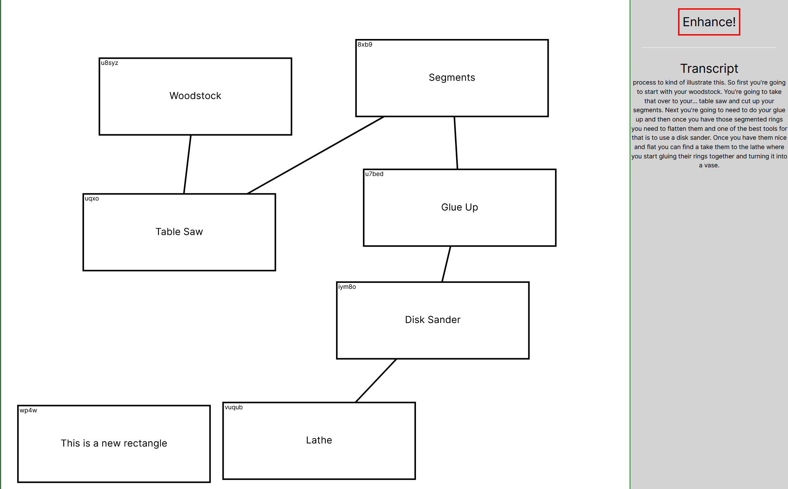
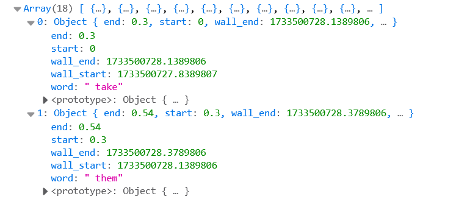
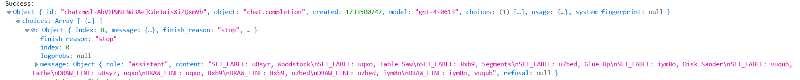

# dialograph (experiment)

In my day job, I often find myself whiteboarding live during meetings to build a visual aid to anchor a discussion around some [complex topic](https://youtu.be/czzAVuVz7u4?si=lrp7opTO2vcNnVmm). There is typically a tradeoff between quality of the diagram and speed to draw. Especially in situations where the audience is external to my immediate teams, and therefore needs more contextual explanation, I noticed myself narrating the diagram while drawing it, and pausing to add labels with enough detail. This seemed like duplicate information, and I started to wonder if an AI agent could help.

Dialograph is an experimental, demonstration tool of the following:
1. Given a virtual whiteboard, the user may click anywhere - on click, a new rectangle is added to the canvas. The user may also click to highlight an existing rectangle.
2. While adding rectangles, the user narrates into the computer microphone.
3. Click Enhance button. Dialograph magically adds labels and connections between rectangles based on the narration, in near real time.

Functionally, Dialograph's flow is:
1. As the user clicks on the canvas to create rectangles, or clicks to highlight an existing rectangle, these actions are logged and timestamped. A unique ID is assigned to each rectangle for identification.
2. As the user speaks, speech to text is performed with timestamping, forming a transcript of the narration.
3. The rectangle actions are converted to textual descriptions, and merged with the transcript.
4. This merged transcript is provided to an LLM, which is prompted to respond with labels and connections for each rectangle.
5. The LLM output is parsed and the diagram updated by connecting nodes and updating labels for each rectangle.

Components:
1. Front-end: UI, transcript merge, LLM calls, result parsing
2. Backend: Microphone speech to text

This is a very hacky proof of concept to test out the idea. I had thought to integrate this with [https://excalidraw.com/](https://excalidraw.com/) but this seemed faster to prototype.

## Run

```
# start up the backend... needs some dependencies
$ python3 speech-server.py

# start up the UI
$ cd ui
$ npm run dev
# open http://localhost:3000/draw
```


# Demo 

Here's a demo of this tool in action, and some snippets of relevant data to understand how it works.

[](https://www.youtube.com/watch?v=eRYA4x-h_yM)

## Screenshot



## Transcript

The frontend component obtains timestamp per word:



## Prompt with Merged Transcript + Actions based on timestamp
```
Transcript:  process to kind of illustrate this. So first [user performed create_rectangle on ID u8syz]  you're going to start with your woodstock. You're going to take that [user performed create_rectangle on ID uqxo]  over to your... table saw and cut up your segments. Next you're [user performed create_rectangle on ID 8xb9]  going to need to do your glue up and then once you have those segmented rings [user performed create_rectangle on ID u7bed]  you need to flatten them and one of the best tools for that is to use a disk [user performed create_rectangle on ID iym8o]  sander. Once you have them nice and flat you can find a take them to the lathe [user performed create_rectangle on ID vuqub]  where you start gluing their rings together and turning it into a vase.

Allowed Actions:
SET_LABEL: ID, my label
DRAW_LINE: ID1, ID2

Instructions: The Transcript is a record of a person talking while creating a
diagram. Enhance the diagram. You can perform any of the Allowed Actions listed,
but no other actions. Respond with one line per action. It is important to
follow the allowed action format precisely. Use IDs from the diagram transcript.
[/INST]
```

## LLM response



Parsed actions from LLM:
```
SET_LABEL: u8syz, Woodstock
SET_LABEL: uqxo, Table Saw
SET_LABEL: 8xb9, Segments
SET_LABEL: u7bed, Glue Up
SET_LABEL: iym8o, Disk Sander
SET_LABEL: vuqub, Lathe
DRAW_LINE: u8syz, uqxo
DRAW_LINE: uqxo, 8xb9
DRAW_LINE: 8xb9, u7bed
DRAW_LINE: u7bed, iym8o
DRAW_LINE: iym8o, vuqub
```
